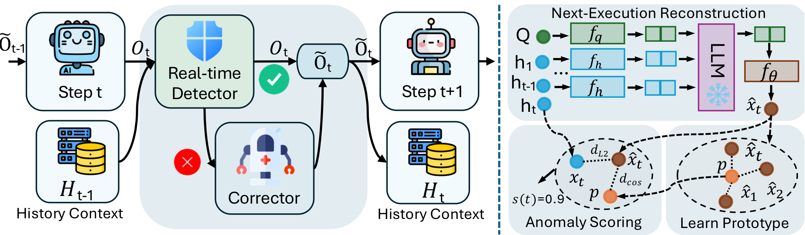

<h1 align="center">MASC: Metacognitive Self-Correction for Multi-Agent Systems</h1>

<p align="center">
  <em>Prototype-Guided Next-Execution Reconstruction for real-time, unsupervised,
  step-level error detection and self-correction in LLM multi-agent systems.</em>
</p>

<p align="center">
  <a href="LICENSE"></a>
  <a href="https://aclanthology.org/2026.findings-acl.1168/"></a>
  <a href="https://huggingface.co/datasets/Kevin355/Who_and_When"></a>
  
</p>

Official implementation of **“Metacognitive Self-Correction for Multi-Agent System
via Prototype-Guided Next-Execution Reconstruction”** (Findings of ACL 2026).
A local copy of the paper is in [`paper/`](paper/).

---

## Overview

LLM multi-agent systems are brittle to **cascading errors**: one faulty step
propagates across agents and derails the whole trajectory. Our preliminary study
finds a single agent's error can cut system-level performance by more than 50%.

MASC treats step-level error detection as **history-conditioned, unsupervised
anomaly scoring**, and acts on it in real time:

<div align="center">
  
</div>

1. **Contextual encoding.** The task query, agent roles and the agent
   role–output history are encoded by a frozen sentence encoder.
2. **Next-execution reconstruction.** A frozen LLM, read through a small trainable
   projection, predicts the *embedding of the next step* from the query and the
   history. Steps that violate the causal flow of normal interaction reconstruct
   poorly. Only the projections and the prototype train.
3. **Prototype-guided enhancement.** A learnable prototype `p` anchors the
   centroid of *normal* step embeddings and stabilises scoring when history is
   sparse — which matters because many errors happen early.
4. **Anomaly-triggered self-correction.** When `s(t) > δ`, a dedicated correction
   agent revises the flagged output *before* it flows downstream.

The anomaly score combines a reconstruction residual with prototype
misalignment:

```
s(t) = α · ‖x̂_t − x_t‖²  +  β · (1 − cos(x̂_t, p))
```

Training uses **only normal trajectories** — no step-level error labels — so
`L = L_recon + λ · L_proto`, both terms defined on normal data alone.

### Why this is label-efficient and deployable

| Challenge | How MASC addresses it |
| --- | --- |
| Step-level error annotations are scarce and expensive | Trains unsupervised on normal trajectories only |
| Normal and abnormal steps look alike in isolation | Conditions on the interaction history via next-execution reconstruction |
| Many errors occur early, with little context | A learnable prototype of normality supplies a prior when history is sparse |
| Verifier agents and RL post-training are costly | Only small projections + a prototype train; encoder and LLM stay frozen |

---

## What this release contains

| Component | Status |
| --- | --- |
| Detector: contextual encoding, next-execution reconstruction, prototype, anomaly scoring | ✅ `masc/` |
| Training / evaluation on **Who&When** (both subsets, w/ and w/o GT) | ✅ `scripts/` + `configs/` |
| Ablations (w/o reconstruction, w/o prototype) | ✅ via `alpha` / `beta` / `lambda_proto` |
| Correction gate (Eq. 13) and the paper's recovery prompt | ✅ `masc/correction.py` |
| Fitting and scoring a MAS framework's own traces | ✅ `scripts/run_mas_detector.py` |
| Baselines: LLM-as-detector, BERT classifier, LLM classifier | ✅ `baselines/` |

**Not included, to be explicit about it:**

- **A runnable end-to-end MAS integration.** Table 2 plugs MASC into Chain,
  Complete-Graph, Random-Graph and LLM-Debate, following the setup of G-Designer
  (Zhang et al., 2024). Re-running those agents requires that framework, which is
  not vendored here. This repo provides the detector, the trigger gate and the
  recovery prompt — the pieces that go *into* such a framework — plus
  `run_mas_detector.py` to fit and score its traces. See
  [MAS integration](#mas-integration).
- **AgentErrorBench data or loaders.** The paper also reports on AgentErrorBench
  (GAIA, WebShop) from AgentDebug (Zhu et al., 2025). Obtain it from its authors;
  a loader for its trace format is not included here.
- **Trained checkpoints.** Only the projections and prototype train, so training
  is cheap — reproduce with `scripts/train_detector.py`.

---

## Repository layout

```
masc/                         The method
├── encoder.py                Frozen sentence encoder (contextual encoding, §3.1)
├── model.py                  Next-execution reconstruction + prototype, losses (§3.2–3.3)
├── scoring.py                Anomaly scoring, teacher-forced or autoregressive (§3.4)
├── correction.py             Eq. 13 trigger gate + the paper's recovery prompt (§3.5)
├── data.py                   Who&When and MAS-trace loaders
├── splits.py                 Deterministic 20/80 train/test splits
├── metrics.py                AUC-ROC / AUPRC / localization accuracy
└── config.py                 YAML-backed experiment config

scripts/
├── make_splits.py            Regenerate data/splits/
├── train_detector.py         Unsupervised training on normal trajectories
├── eval_detector.py          Held-out detection + localization metrics
└── run_mas_detector.py       Fit / score a MAS framework's own traces

configs/                      One YAML per reported column (Table 1) + mas_trace.yaml
baselines/
├── llm_as_detector/          All-at-Once, Step-by-Step, Binary Search (+ scoring)
└── supervised/               BERT and LLM-encoder classifiers
analysis/                     Dataset statistics and the separability analysis
experimental/                 Exploratory code, not part of the reported results
tools/mast/                   MAST / MAD data-prep utilities
data/Who&When/                The 184 annotated failure trajectories
data/splits/                  The train/test split used by every method
paper/                        Local PDF copies
```

---

## Setup

```bash
git clone https://github.com/edzq/MASC.git
cd MASC
python -m venv .venv && source .venv/bin/activate
pip install -r requirements.txt
```

Or install the package so `import masc` works from anywhere:

```bash
pip install -e ".[analysis,baselines]"
```

A GPU is needed for anything involving the LLM backbone. Loading
LLaMA-3.1-8B-Instruct in bf16 takes roughly 16 GB; `device_map: auto` shards it
across whatever GPUs are visible. Set `base_model` to a smaller backbone (e.g.
`Qwen/Qwen2.5-7B-Instruct`) or a local path if you have weights on disk.

### Data

The Who&When trajectories ship with this repo under
[`data/Who&When/`](data/Who&When) — 58 hand-crafted (Magentic-One style) and 126
algorithm-generated (CaptainAgent) annotated failures, built on GAIA and
AssistantBench queries. Each record carries the full `history`, the
`mistake_agent`, the `mistake_step` and a natural-language `mistake_reason`. The
benchmark is also on [Hugging Face](https://huggingface.co/datasets/Kevin355/Who_and_When).

The shared 20% / 80% split is committed under [`data/splits/`](data/splits) so
every method sees the same trajectories. To regenerate it:

```bash
python scripts/make_splits.py            # needs no torch
```

---

## Quick start

Train the detector on normal trajectories, then score the held-out ones:

```bash
# Who&When, Algorithm-Generated, w/o GT
python scripts/train_detector.py --config configs/algorithm_generated.yaml

python scripts/eval_detector.py --config configs/algorithm_generated.yaml \
    --checkpoint outputs/masc/algorithm_generated/detector.pt
```

`eval_detector.py` prints step-level detection metrics and trajectory-level
localization accuracy, and writes per-step scores to
`<output_dir>/eval_results.json`.

One config per reported column, with the hyperparameters from Table 6:

| Config | Subset | Condition | epochs | lr | α | β |
| --- | --- | --- | --- | --- | --- | --- |
| `configs/hand_crafted.yaml` | Hand-Crafted | w/o GT | 10 | 1e-4 | 1.0 | 0.1 |
| `configs/hand_crafted_gt.yaml` | Hand-Crafted | w/ GT | 10 | 1e-4 | 1.0 | 0.1 |
| `configs/algorithm_generated.yaml` | Algorithm-Generated | w/o GT | 5 | 5e-5 | 0.8 | 0.2 |
| `configs/algorithm_generated_gt.yaml` | Algorithm-Generated | w/ GT | 5 | 5e-5 | 0.8 | 0.2 |

**w/ GT vs. w/o GT.** `w/o GT` scores trajectories from the agent logs alone;
`w/ GT` additionally exposes the task's reference answer. In this implementation
`include_ground_truth: true` appends that answer to the query heading the
context. Every CLI flag overrides the YAML, so you can sweep without editing files:

```bash
python scripts/eval_detector.py --config configs/hand_crafted.yaml \
    --checkpoint outputs/masc/hand_crafted/detector.pt --threshold 0.6
```

### Ablations

The two score terms and the prototype loss are plain config values, so Figure 3's
ablations need no code changes:

```bash
# w/o prototype: reconstruction residual only
python scripts/train_detector.py --config configs/hand_crafted.yaml \
    --lambda_proto 0 --output_dir outputs/ablation/no_proto
python scripts/eval_detector.py --config configs/hand_crafted.yaml \
    --checkpoint outputs/ablation/no_proto/detector.pt --beta 0 \
    --output_dir outputs/ablation/no_proto

# w/o reconstruction: prototype misalignment only
python scripts/eval_detector.py --config configs/hand_crafted.yaml \
    --checkpoint outputs/masc/hand_crafted/detector.pt --alpha 0 \
    --output_dir outputs/ablation/no_recon
```

`--scoring_mode autoregressive` extends the history with the model's own
predictions instead of the observed ones — useful for probing how far the model
rolls forward unobserved. The reported numbers use the default
`teacher_forcing`, which matches deployment: at step `t` the system really has
seen steps `< t`.

---

## MAS integration

Inside a live framework MASC runs as a monitor beside the agents. Fit it on
traces of that framework's *normal* behaviour, then let it gate corrections:

```bash
# 1. Learn what normal execution looks like for this framework
python scripts/run_mas_detector.py --mode fit \
    --trace_dir traces/mmlu/FullConnected --output_dir outputs/masc/mmlu

# 2. Score traces and see which steps would trigger a correction
python scripts/run_mas_detector.py --mode score \
    --trace_dir traces/mmlu/FullConnected \
    --checkpoint outputs/masc/mmlu/detector.pt
```

Traces are JSON files `0.json, 1.json, …` with a `question.task` string and a
`history` list of `{"content": ...}` entries.

To wire the correction step into your own framework, the gate and the paper's
recovery prompt are importable:

```python
from masc.correction import should_intervene, build_recovery_prompt, parse_recovery_reply

if should_intervene(score, threshold=0.5):
    prompt = build_recovery_prompt(
        role=agent.role, question=task, response=output, context=history[-2:]
    )
    decision = parse_recovery_reply(your_llm(prompt), original=output)
    output = decision.output          # revised, or the original if no change was needed
```

`parse_recovery_reply` keeps the original output whenever the correction agent
declines or returns something unparsable, so a failed correction can never
corrupt a good response.

---

## Baselines

All baselines read the same `data/splits/`, so their numbers are directly
comparable to the detector's.

**LLM-as-detector** (prompts adopted unmodified from Who&When):

```bash
export AZURE_OPENAI_API_KEY=...        # never pass keys on the command line
export AZURE_OPENAI_ENDPOINT=https://<resource>.openai.azure.com/

cd baselines/llm_as_detector
python run_inference.py --method step_by_step --model gpt-4o-mini \
    --directory_path ../../data/Who\&When/Algorithm-Generated --is_handcrafted False

python evaluate.py --data_path ../../data/Who\&When/Algorithm-Generated \
    --eval_file outputs_no_answer/step_by_step_gpt-4o-mini_alg_generated.txt
```

`--method` is `all_at_once`, `step_by_step`, `binary_search`, `slide_window` or
`buffer`; `--model` is a GPT deployment (`gpt-4o`, `gpt-4o-mini`, `gpt4`) or a
local checkpoint (`llama-8b`, `llama-70b`, `qwen-7b`, `qwen-72b`). Add
`--use_ground_truth` for the w/ GT condition. Predictions land in `outputs/`
(w/ GT) or `outputs_no_answer/` (w/o GT).

`evaluate.py --metric attribution` gives Who&When's agent/step accuracy;
`--metric step_level` gives per-step detection. `evaluate_step_level.py` applies
a stricter protocol that charges a false positive for every step between an early
flag and the real error.

**Supervised classifiers** (these *do* use step labels, unlike MASC):

```bash
python baselines/supervised/train_bert.py --subset Hand-Crafted
python baselines/supervised/train_llm_classifier.py --subset Hand-Crafted \
    --model_path meta-llama/Llama-3.1-8B-Instruct
```

---

## Analysis

```bash
python analysis/dataset_stats.py                       # Appendix B statistics
python analysis/plot_error_positions.py --out_dir figures
python analysis/embedding_separability.py --out_dir figures
```

`embedding_separability.py` quantifies the paper's motivating observation: the
inter-cluster distance between normal and erroneous step embeddings is small
relative to the spread *within* each cluster, so single steps are not separable
on their own — and a minimal context aggregation already improves the ratio.

---

## Results

**Step-level error detection** (AUC-ROC / step accuracy, %). Best baseline per
column shown for reference; see Table 1 of the paper for the full grid.

| Backbone | Method | HC w/ GT | HC w/o GT | Auto w/ GT | Auto w/o GT | ErrorBench GAIA | ErrorBench WebShop |
| --- | --- | --- | --- | --- | --- | --- | --- |
| Gemini-2.5-Flash | Step-by-Step | 62.58/16.91 | 43.94/13.19 | 30.54/12.56 | 26.37/9.81 | 46.12/10.00 | 22.49/3.00 |
| all-MiniLM-L6-v2 | BERT Classifier | 60.58/10.37 | 72.86/13.79 | 62.91/15.21 | 67.15/13.68 | 70.57/21.00 | 49.68/10.00 |
| Qwen-2.5-7B | LLM Classifier | 64.75/13.41 | 72.97/16.67 | 61.79/22.50 | 55.23/17.71 | 74.61/24.50 | 64.66/14.00 |
| GPT-4o-mini | AgentDebug | 57.36/14.69 | 68.91/19.74 | **74.31**/16.87 | 71.38/18.19 | 84.26/58.00 | 74.38/35.00 |
| Qwen-2.5-7B | **MASC** | 65.84/17.45 | 68.52/28.08 | 64.51/18.79 | 68.60/24.43 | 79.93/47.50 | 70.33/50.00 |
| LLaMA-3.1-8B | **MASC** | **69.10/18.25** | **77.84/20.79** | 69.62/19.24 | **75.62/21.72** | **86.78/60.00** | **80.36/57.50** |

MASC leads on five of the six columns — including against the *supervised*
baselines — while using no error labels at all, with up to **+8.47 AUC-ROC** in
the challenging w/o GT setting (Auto w/o GT vs. the BERT classifier). On Auto
w/ GT the supervised AgentDebug remains ahead on AUC-ROC (74.31 vs. 69.62), while
MASC still localizes the error step more often (19.24 vs. 16.87).

**End-to-end gains when plugged into MAS frameworks** (accuracy, %; all agents
GPT-4o-mini, G-Designer setup):

| Method | MMLU | GSM8K | AQuA | MultiArith | SVAMP | HumanEval | Avg. |
| --- | --- | --- | --- | --- | --- | --- | --- |
| Chain | 83.01 | 88.30 | 74.05 | 93.27 | 87.17 | 81.37 | 84.53 |
| **+ MASC** | 83.57 | 90.51 | 76.23 | 93.96 | 88.54 | 82.91 | **85.95** |
| Random | 84.31 | 86.90 | 76.48 | 94.08 | 87.54 | 82.66 | 85.33 |
| **+ MASC** | 85.29 | 88.91 | 77.12 | 94.82 | 88.29 | 84.01 | **86.41** |
| LLM-Debate | 84.96 | 91.40 | 77.65 | 96.36 | 90.11 | 84.70 | 87.53 |
| **+ MASC** | 86.11 | 93.39 | 79.21 | 97.15 | 91.26 | 86.23 | **88.89** |

Consistent gains across architectures (+1.29 on average) at minimal overhead,
since correction only fires on flagged steps.

---

## Reproducibility notes

These are the places where this release deliberately differs from the research
scripts it was cleaned up from. None of them change the method.

- **Split files.** The original split depended on `os.listdir` order, which is
  filesystem-dependent. `make_splits.py` sorts before shuffling, so the split is
  reproducible from the seed alone. It yields 11/47 (Hand-Crafted) and 25/101
  (Algorithm-Generated); the paper reports 10/45 and 25/100, a handful of
  trajectories having been excluded in the original runs. Expect small deviations
  from the published numbers for that reason.
- **Localization offset.** For Hand-Crafted trajectories no query is prepended to
  the context, so score index `i` corresponds to history step `i + 1`.
  `masc.metrics.localization_accuracy` accounts for that offset; the original
  script did not, which understated Hand-Crafted localization.
- **Optimizer.** AdamW with `weight_decay: 0.0`, matching Table 6. The original
  script relied on AdamW's default `0.01`.
- **Ground truth in local-model baselines.** The local Llama/Qwen path used to
  inject the reference answer unconditionally, making its "w/o GT" runs
  effectively w/ GT. It now honours `--use_ground_truth` like the Azure path.
- **Binary Search tie-breaks** are seeded (`$MASC_SEED`, default 42) so an
  ambiguous judge reply resolves the same way across runs.
- **Sliding-window trajectory batching**, a disabled experiment in the original
  detector script, was not carried over.

---

## Citation

```bibtex
@inproceedings{shen2026masc,
  title     = {Metacognitive Self-Correction for Multi-Agent System via
               Prototype-Guided Next-Execution Reconstruction},
  author    = {Shen, Xu and Zhang, Qi and Wang, Song and Tan, Zhen and
               Zhao, Xinyu and Yao, Laura and Tadiparthi, Vaishnav and
               Nourkhiz Mahjoub, Hossein and Moradi Pari, Ehsan and
               Lee, Kwonjoon and Chen, Tianlong},
  booktitle = {Findings of the Association for Computational Linguistics: ACL 2026},
  pages     = {23320--23337},
  year      = {2026},
  url       = {https://aclanthology.org/2026.findings-acl.1168/}
}
```

## Acknowledgements

MASC is evaluated on the **Who&When** benchmark and compared against its
LLM-as-detector protocols, which this repository adopts unmodified:

```bibtex
@inproceedings{zhang2025agent,
  title     = {Which Agent Causes Task Failures and When? On Automated Failure
               Attribution of LLM Multi-Agent Systems},
  author    = {Zhang, Shaokun and Yin, Ming and Zhang, Jieyu and Liu, Jiale and
               Han, Zhiguang and Zhang, Jingyang and Li, Beibin and Wang, Chi and
               Wang, Huazheng and Chen, Yiran and Wu, Qingyun},
  booktitle = {International Conference on Machine Learning (ICML)},
  year      = {2025}
}
```

The end-to-end integration setup follows **G-Designer**, and the AgentErrorBench
comparison uses **AgentDebug**. Released under the [MIT License](LICENSE).
